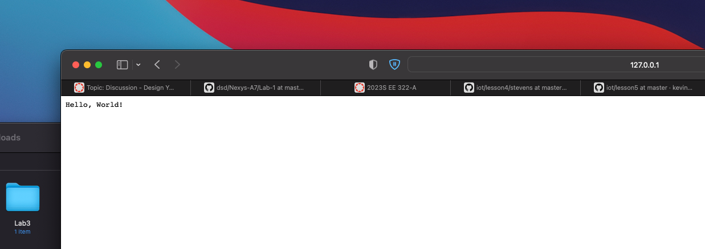

Screenshot of lab6 live web page running hello-world.js


Terminal output:
```
(base) christiantemplin@Christians-Air lesson6 % node hello-world.js
Server running at http://127.0.0.1:3000/
^C
(base) christiantemplin@Christians-Air lesson6 % node hello.js
Server running at http://127.0.0.1:8080/
response end call done
request end event fired
response end call done
request end event fired
^C
(base) christiantemplin@Christians-Air lesson6 % node http.js
0

1
2
3
4
^C
(base) christiantemplin@Christians-Air lesson6 % 
```
Pystache Terminal Results:

```
cat say_hello.mustache
Hello, {{to}}!
(base) christiantemplin@Christians-Air lesson6 % cat say_hello.py
# https://github.com/defunkt/pystache
import pystache
print(pystache.render('Hi {{person}}!', {'person': 'Alexa'}))

# Create dedicated view classes to hold view logic
class SayHello(object):
    def to(self):
        return "World"
hello = SayHello()

# Use template in say_hello.mustache
renderer = pystache.Renderer()
print(renderer.render(hello))

# Pre-parse a template
parsed = pystache.parse('Hey {{#who}}{{.}}!{{/who}}')
print(parsed)
print(renderer.render(parsed, {'who': 'Google'}))
print(renderer.render(parsed, {'who': 'Siri'}))
(base) christiantemplin@Christians-Air lesson6 % python3 say_hello.py
Hi Alexa!
Hello, World!

['Hey ', _SectionNode(key='who', index_begin=12, index_end=18, parsed=[_EscapeNode(key='.'), '!'])]
Hey Google!
Hey Siri!
(base) christiantemplin@Christians-Air lesson6 % 
```
