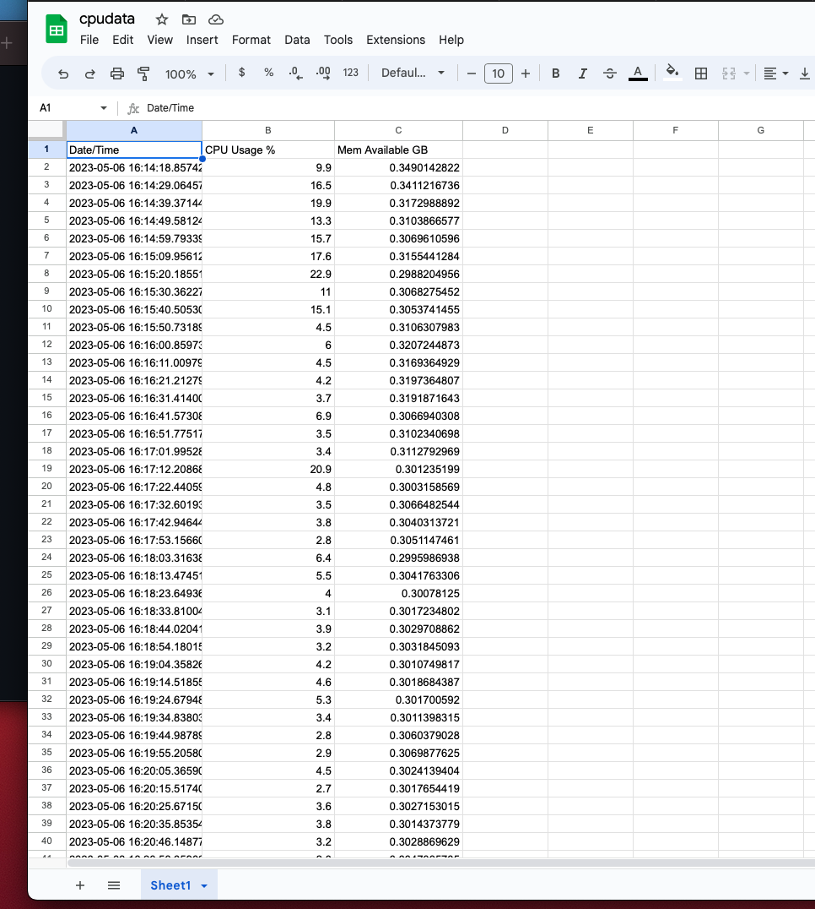

Terminal results of thingspeak programs:
```
(base) christiantemplin@Christians-Air demo % python3 thingspeak_feed.py
An API key savefile was not found. Enter Write API Key >>> SGM2AAC723S30U0E
Should we save this key for future use? [y/N] >>> y
20.1
312.8671875
Fri, 05 May 2023 19:33:54
200 OK
4.8
310.94140625
Fri, 05 May 2023 19:34:54
200 OK
2.0
308.640625
Fri, 05 May 2023 19:35:54
200 OK
1.8
306.78125
Fri, 05 May 2023 19:36:54
200 OK
1.2
307.671875
Fri, 05 May 2023 19:37:54
200 OK
1.5
309.00390625
Fri, 05 May 2023 19:38:54
200 OK

```
Output from running cpudata program:

