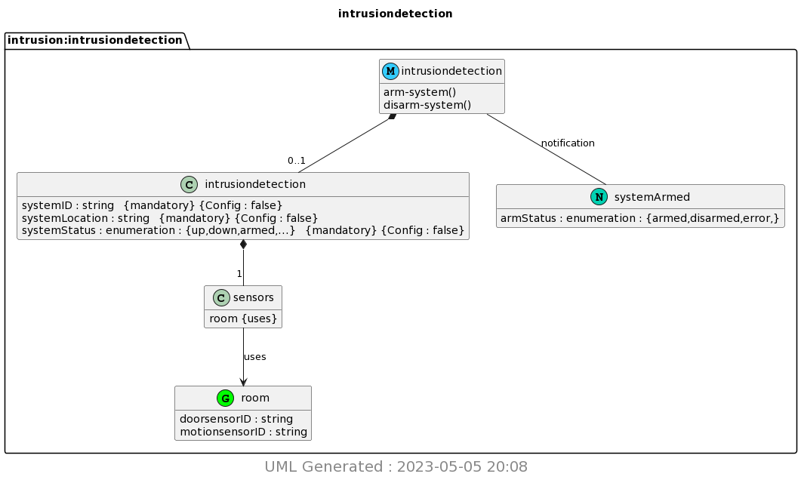

Resultant image

Terminal Results:
```
(base) christiantemplin@Christians-Air demo % pyang -f yin -o intrusiondetection.yin intrusiondetection.yang
(base) christiantemplin@Christians-Air demo % pyang -f uml -o intrusiondetection.uml intrusiondetection.yang --uml-no=stereotypes,annotation,typedef
(base) christiantemplin@Christians-Air demo % python3 -m plantuml intrusiondetection.uml
[{'filename': 'intrusiondetection.uml', 'gen_success': True}]
(base) christiantemplin@Christians-Air demo % ls
API_KEY.pickle		intrusiondetection.png	intrusiondetection.yin
file.save		intrusiondetection.uml	thingspeak_cpu_loop.py
file1.txt		intrusiondetection.yang	thingspeak_feed.py
(base) christiantemplin@Christians-Air demo % 
```
